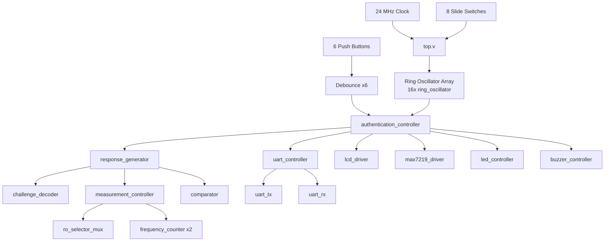
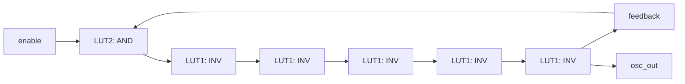
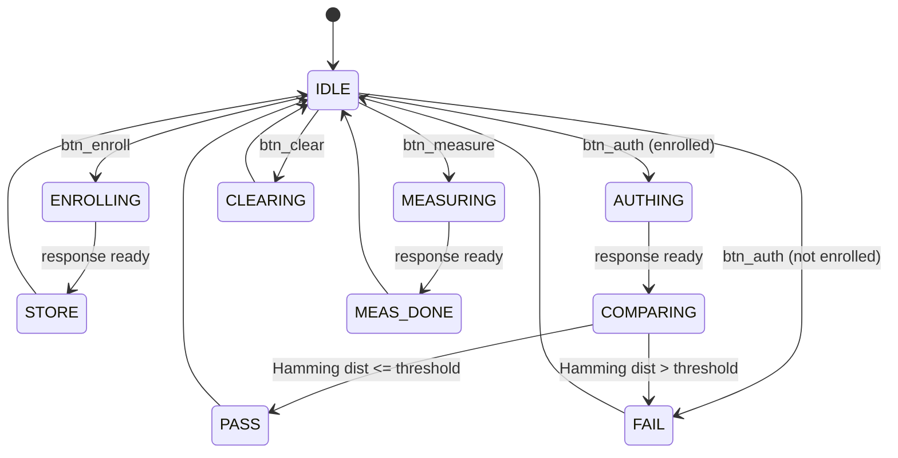

# Ring Oscillator PUF Authentication System
## Hardware Root-of-Trust on a Xilinx Artix-7 FPGA: Architecture, Operation, and Pin Reference

---

## 1. System Overview

### 1.1 Design Objective

This project implements a **hardware-based authentication system** built around a **Ring Oscillator Physical Unclonable Function (RO-PUF)**. A PUF exploits microscopic, uncontrollable variations introduced during semiconductor manufacturing — even two FPGAs cut from the same silicon wafer, running an identical bitstream, will produce ring oscillators with slightly different propagation delays. This system harvests that physical randomness to generate a device-unique digital fingerprint that cannot be cloned, copied, or predicted, even by the manufacturer.

The design implements a complete **challenge-response authentication protocol**: a user selects an 8-bit *challenge* (via on-board slide switches), the system measures oscillator frequencies to derive an 8-bit *response*, and that response is either **enrolled** as a reference fingerprint or **compared** against a previously enrolled one using Hamming-distance matching. The full system is exposed through five user-facing peripherals — an LCD, a 7-segment display, status LEDs, an audible buzzer, and a UART debug interface — any of which can be independently enabled or disabled.

The design targets a **Xilinx Artix-7 (XC7A35T-FTG256-1)** FPGA on the **AT-STLN-ARTIX7-001** development board, clocked at **24 MHz**, and is built entirely in synthesizable Verilog RTL with hand-placed physical constraints in Vivado.

### 1.2 Why a Ring Oscillator PUF

A ring oscillator is formed by chaining an **odd number of inverters** in a feedback loop — the circuit has no stable logic state, so it oscillates continuously at a frequency determined by the cumulative propagation delay around the loop. That delay is sensitive to sub-nanometer variations in transistor doping, gate oxide thickness, and interconnect parasitics that occur randomly during fabrication. Two physically identical-looking oscillators on the same chip will therefore run at *measurably different* frequencies.

By placing many such oscillators at fixed, known locations on the FPGA fabric and comparing their frequencies pairwise, this system converts that physical randomness into a reproducible, but unclonable, binary fingerprint — the foundation of a **hardware root-of-trust**.

### 1.3 Top-Level System Architecture

The top-level module (`top.v`) instantiates and wires together every subsystem in the design. It owns the single 24 MHz system clock, a synchronous power-on reset generator, and all physical board-level I/O.



### 1.4 Module Hierarchy

```
top
├── debounce            [x6]    — one per push button
├── ring_oscillator      [x16]   — the physical PUF source
├── authentication_controller
│   └── response_generator
│       ├── challenge_decoder
│       ├── measurement_controller
│       │   ├── ro_selector_mux
│       │   └── frequency_counter   [x2]
│       └── comparator
├── uart_controller
│   ├── uart_tx
│   └── uart_rx
├── lcd_driver
├── max7219_driver
├── led_controller
├── buzzer_controller
└── clock_divider        (debug utility, unused in main data path)
```

---

## 2. Core PUF Engine

### 2.1 Ring Oscillator (`ring_oscillator.v`)

Each of the 16 ring oscillators is built directly from Xilinx **LUT1** and **LUT2** hardware primitives rather than generic Verilog gates, so that Vivado cannot optimize, retime, or merge them during synthesis — a guarantee that is essential for a PUF, since the whole design relies on each oscillator occupying a *specific, physically distinct* location on the die.

**Topology:** one `LUT2` configured as an AND gate (enable-gated) feeds a **5-stage inverter chain** built from five `LUT1` primitives, with the final stage looped back to the AND gate's second input.



Five inversions is an **odd number**, so the loop has no stable logic level and oscillates continuously whenever `enable=1`. When `enable=0`, the AND gate output is forced low, breaking the loop and quenching oscillation — this lets the design power only the two oscillators currently being measured, reducing switching noise and crosstalk between cells. Every LUT instance carries `DONT_TOUCH` and `KEEP` attributes, and the wraparound nets carry `ALLOW_COMBINATORIAL_LOOPS`, since Vivado's design-rule checks normally forbid combinational feedback loops.

Each of the 16 instances is hand-placed at a fixed `SLICE_X0Y{n}` location via the XDC file (see Section 5), ensuring every oscillator occupies a known, repeatable physical position on the die — critical for the manufacturing-variation effect this design depends on.

### 2.2 Frequency Counter (`frequency_counter.v`)

Counts rising edges of a single oscillator's output over a fixed **gate window** of `GATE_CYCLES` system-clock cycles (default 65,536 cycles, ≈2.73 ms at 24 MHz). Because the oscillator runs asynchronously to the system clock, its signal first passes through a **3-flip-flop synchronizer** (marked `ASYNC_REG`) before edge detection, preventing metastability from corrupting the count. On `start`, the counter clears and begins counting; once the gate window elapses, the final count is latched and `valid` is asserted.

### 2.3 Ring Oscillator Selector Mux (`ro_selector_mux.v`)

A dual 16:1 multiplexer that picks out two of the sixteen oscillator outputs (`mux_a`, `mux_b`) for comparison, addressed by 4-bit select lines `sel_a` and `sel_b`. This module is implemented with an explicit case statement (rather than a dynamic bit-select) specifically because dynamic indexing risks being optimized away by Vivado's synthesis engine, silently severing the connection between the oscillators and the measurement logic.

### 2.4 Challenge Decoder (`challenge_decoder.v`)

Converts an 8-bit *challenge* (the slide-switch value) plus a 3-bit *response-bit index* (0–7) into a pair of 4-bit oscillator selection indices:

```
ro_sel_a = challenge[7:4] XOR {1'b0, bit_index}
ro_sel_b = challenge[3:0] XOR {1'b0, bit_index}
```

This XOR-based derivation means every one of the 8 response bits compares a *different* pair of oscillators, all derived deterministically from the same challenge — so the same switch setting always re-derives the same 8 oscillator pairs, while still producing a full 8-bit response that explores most of the 16-oscillator array.

### 2.5 Measurement Controller (`measurement_controller.v`)

Orchestrates one complete frequency-comparison cycle for a single oscillator pair through a 6-state FSM:

| State | Action |
|---|---|
| `IDLE` | Waits for `start` |
| `ENABLE` | Asserts `ro_enable` for the selected pair only |
| `SETTLE` | Waits `SETTLE_CYCLES` (default 1024 cycles) for the oscillators to stabilize before measuring |
| `COUNT` | Issues the start pulse to both frequency counters simultaneously |
| `WAIT` | Polls until both counters report `valid` |
| `DONE` | Latches results, de-asserts `ro_enable`, returns to `IDLE` |

### 2.6 Comparator (`comparator.v`)

A single combinational comparison: `response_bit = (count_a > count_b)`. This is the actual point where physical randomness becomes a digital bit — since `count_a` and `count_b` come from two oscillators with manufacturing-variation-driven frequency differences, this comparison reliably produces the same bit on every re-measurement of the same chip, but a different (effectively random) bit pattern across different chips.

### 2.7 Response Generator (`response_generator.v`)

Sequences eight full measurement cycles (one per response bit) to build the complete 8-bit PUF response for a given challenge, cycling the `challenge_decoder` → `measurement_controller` → `comparator` pipeline once per bit and accumulating the result.

### 2.8 Authentication Controller (`authentication_controller.v`)

The top-level state machine governing all user interaction. Maintains a **256-entry × 8-bit enrollment memory** (one slot per possible 8-bit challenge) plus a 256-bit `enrolled` flag vector, and exposes four operations:

| Button | Operation |
|---|---|
| **Enroll** | Generates a response for the current challenge and stores it as the reference fingerprint |
| **Authenticate** | Generates a fresh response and compares it against the stored fingerprint using **Hamming distance** |
| **Measure** | Generates a response for display purposes only — no storage, no comparison |
| **Clear** | Wipes the entire enrollment memory |

Authentication uses a configurable **Hamming-distance threshold** (default 1 bit) rather than requiring an exact match, since PUF responses can exhibit minor bit-flip noise across temperature and voltage variation — this tolerance is what makes the system usable in practice rather than purely theoretical.



---

## 3. User-Facing Peripherals

Every peripheral below is driven from the same shared system state (`auth_state`, `current_response`, `stored_response`, oscillator counts, enrollment flag) so that all outputs stay synchronized — the LCD, 7-segment display, LEDs, and UART dump always agree on what the system is currently doing.

### 3.1 LCD Display (`lcd_driver.v`)

Drives a standard **16×2 character LCD** (HD44780-compatible) in **8-bit parallel mode**. On reset, the driver executes the full power-on initialization sequence (Function Set → Display ON → Entry Mode → Clear Display), each step separated by datasheet-mandated timing delays generated from clock-cycle counters. Once initialized, the driver accepts a 128-bit packed string (`line1`, `line2` — 16 ASCII characters each) and an `update` pulse, writing all 32 characters across both lines automatically.

In `top.v`, the LCD refreshes roughly **24 times per second**, displaying:

- **Line 1:** the current system state in plain English (e.g. `RO-PUF AUTH SYS`, `ENROLLING...`, `** AUTH PASS **`, `!! AUTH FAIL !!`)
- **Line 2:** `SW:XX RSP:XX E:Y` — the current switch/challenge value, the live PUF response, and whether that challenge has been enrolled

| LCD Pin | Signal | Description |
|---|---|---|
| RS | `lcd_rs` | Register select (0=command, 1=data) |
| R/W | `lcd_rw` | Read/write (tied low — write only) |
| E | `lcd_en` | Enable strobe |
| D0–D7 | `lcd_d[7:0]` | 8-bit parallel data bus |

### 3.2 7-Segment Display (`max7219_driver.v`)

Drives an 8-digit 7-segment display through a **MAX7219** driver chip over a 3-wire SPI-like serial interface (`seg_din`, `seg_clk`, `seg_load`). On reset, the driver issues the MAX7219 initialization command sequence (decode mode off, intensity, scan limit, normal operation, display test off), then accepts a 32-bit `display_data` word on each `update` pulse and serially shifts out all 8 hex digits.

The content shown depends on the current authentication state:

| State | Displayed Content |
|---|---|
| `IDLE` | Switches (challenge) in the upper digits, live response in the lower digits |
| `AUTH_PASS` / `AUTH_FAIL` | Stored response vs. current response, side by side |
| `MEASURE_DONE` | Raw oscillator counts — `count_a` and `count_b`, 16 bits each |

| Signal | Direction | Description |
|---|---|---|
| `seg_din` | Output | Serial data out |
| `seg_clk` | Output | Serial clock |
| `seg_load` | Output | Load/latch (active high on rising edge) |

> **Note:** in the current `top.v`, the three 7-segment output ports are declared internally but **commented out of the top-level port list**, so the display logic runs but is not wired to physical pins. Uncommenting the three `output wire` lines for `seg_din`, `seg_load`, `seg_clk` in the port declaration (they are already correctly mapped in the XDC) is sufficient to bring the display online.

### 3.3 Status LEDs (`led_controller.v`)

Eight LEDs provide an at-a-glance visual readout of system state, with a distinct animation or pattern for each of the ten authentication states:

| State | LED Behavior |
|---|---|
| `IDLE` | Single heartbeat blink on `led[0]` (0.5 Hz) |
| `ENROLLING` | Left-scanning bar |
| `STORE` (enrolled) | `led[1]` solid on |
| `AUTHENTICATING` | Right-scanning bar |
| `COMPARING` | All 8 LEDs blinking together (fast) |
| `AUTH_PASS` | All 8 LEDs solid on |
| `AUTH_FAIL` | Alternating odd/even LED blink pattern |
| `MEASURING` | Two-LED chasing pattern |
| `MEASURE_DONE` | Raw 8-bit PUF response value displayed directly on the LEDs |
| `CLEARING` | All 8 LEDs rapid blink |

### 3.4 Buzzer (`buzzer_controller.v`)

Generates audible pass/fail feedback through a single piezo buzzer pin, using a clock-cycle-counted square wave generator (no analog components required):

| Event | Tone | Pattern |
|---|---|---|
| **Auth Pass** | 2 kHz | Single 200 ms beep |
| **Auth Fail** | 1 kHz | Three 100 ms beeps with 100 ms gaps between |

### 3.5 Slide Switches & Push Buttons (board input)

| Input | Width | Function |
|---|---|---|
| `sw[7:0]` | 8 bits | The 8-bit **challenge** value — directly read by `authentication_controller` |
| `btn_enroll` | 1 bit | Enroll the current challenge's PUF response |
| `btn_auth` | 1 bit | Authenticate against the stored response for the current challenge |
| `btn_measure` | 1 bit | Take a one-off measurement, display only |
| `btn_clear` | 1 bit | Wipe all enrollment memory |
| `btn_uart_dump` | 1 bit | Trigger a full status dump over UART |

All six push-button inputs (the five above plus a reserved/reset line) pass through individual `debounce.v` instances — each uses a 2-flip-flop synchronizer followed by a 20 ms debounce counter, producing both a clean debounced level and a single-cycle press pulse, so a single physical press never registers as multiple logical presses.

### 3.6 UART Debug Interface (`uart_controller.v`, `uart_tx.v`, `uart_rx.v`)

A full **8N1 UART** running at **115,200 baud**, used purely as a debug/observability channel. Pressing `btn_uart_dump` snapshots all current system values and transmits a formatted, human-readable status report:

```
PUF AUTH SYSTEM
CHL:87
RSP:BD
STO:BD
CTA:00004E42
CTB:0000425A
STS:0
ENR:1
```

| Field | Meaning |
|---|---|
| `CHL` | Challenge (switch value), hex |
| `RSP` | Live PUF response, hex |
| `STO` | Stored (enrolled) response for this challenge, hex |
| `CTA` / `CTB` | Raw oscillator A/B counts from the last measurement, hex |
| `STS` | Current authentication-controller state code |
| `ENR` | Whether the current challenge has been enrolled (1/0) |

`uart_tx.v` and `uart_rx.v` are independent, reusable 8N1 transmit/receive modules; `uart_rx` is instantiated and fully functional but unused for command input in the current design — it is wired in for future extension (e.g. remote-triggered enrollment).

---

## 4. Pin Assignment Reference

All physical I/O is constrained via XDC against the **AT-STLN-ARTIX7-001** board manual (`ANM-PRD-2025-005 Rev 1.0`).

### 4.1 Clock & Core I/O

| Signal | FPGA Pin | Bank | Notes |
|---|---|---|---|
| `clk_24mhz` | D13 | 15 | MRCC-capable clock pin, 24 MHz oscillator |
| `led[7:0]` | D5, A3, B4, A4, E6, C13, C14, D14 | 35 | 8 user LEDs |
| `sw[7:0]` | C9, B9, G5, A7, C7, A10, B7, A8 | 35 | 8 slide switches |

### 4.2 Push Buttons (mapped to 4×4 keypad pins)

> Section 3.6 (Push Buttons) of the board manual Rev 1.0 does not document dedicated push-button FPGA pins. Since this design does not use the on-board keypad, the six logical buttons are mapped onto the keypad matrix pins instead — these already have 10K pull-ups and 100 nF debounce capacitors on the PCB.

| Port | Keypad Key | FPGA Pin | Bank |
|---|---|---|---|
| `btn_enroll` | 0 | A13 | 35 |
| `btn_auth` | 1 | F5 | 35 |
| `btn_measure` | 2 | E3 | 35 |
| `btn_clear` | 3 | F2 | 35 |
| `btn_uart_dump` | 4 | A12 | 35 |
| `btn_reserved` | 5 | D6 | 35 |

### 4.3 LCD (16×2, 8-bit mode) — Bank 35

| Signal | FPGA Pin |
|---|---|
| `lcd_rs` | G4 |
| `lcd_rw` | H3 |
| `lcd_en` | E1 |
| `lcd_d[0]` | G2 |
| `lcd_d[1]` | G1 |
| `lcd_d[2]` | H5 |
| `lcd_d[3]` | H4 |
| `lcd_d[4]` | J5 |
| `lcd_d[5]` | J4 |
| `lcd_d[6]` | H2 |
| `lcd_d[7]` | H1 |

### 4.4 MAX7219 7-Segment Display — Bank 15

| Signal | FPGA Pin |
|---|---|
| `seg_din` | J15 |
| `seg_load` | J16 |
| `seg_clk` | H12 |

### 4.5 Buzzer & UART — Banks 34/35

| Signal | FPGA Pin | Notes |
|---|---|---|
| `buzzer` | K5 | Bank 35 |
| `uart_tx` | T2 | Bank 34, PMOD — requires external USB-UART adapter |
| `uart_rx` | R3 | Bank 34, PMOD |

### 4.6 Ring Oscillator Placement

All 16 ring oscillators are explicitly placed at fixed slice locations to guarantee physically consistent, repeatable positions:

```tcl
set_property LOC SLICE_X0Y{n} [get_cells gen_ro[{n}].u_ro/lut_and]
set_property LOC SLICE_X0Y{n} [get_cells gen_ro[{n}].u_ro/lut_inv0]
... (lut_inv1 through lut_inv4)
```
for `n = 0` through `15`.

---

## 5. Modular Design — Disabling Individual Peripherals

A core design goal of this project was **peripheral independence**: every output subsystem (LCD, 7-segment, buzzer, LEDs, UART) is wired into `top.v` through its own clearly delimited section, so that any single peripheral can be removed from the build **without touching any other module**.

To disable a peripheral, comment out its corresponding block in `top.v`:

| To disable... | Comment out in `top.v` |
|---|---|
| **LCD** | The `lcd_driver` instantiation block, the LCD text-formatter `always` blocks, and the `lcd_rs`/`lcd_en`/`lcd_d` output port declarations (already pre-commented as a template) |
| **7-Segment Display** | The `max7219_driver` instantiation block and the `seg_display_data` update `always` block; the `seg_din`/`seg_load`/`seg_clk` ports are already commented out by default |
| **Buzzer** | The `buzzer_controller` instantiation and the `assign buzzer = buzzer_out;` line; the `buzzer` output port is already commented out by default |
| **LEDs** | The `led_controller` instantiation and the `assign led = led_out;` line, plus the `led` port in the port list |
| **UART** | The `uart_controller` instantiation block and the `uart_tx`/`uart_rx` ports |

Because each peripheral only *reads* shared state signals (`auth_state`, `current_response`, etc.) and never feeds anything back into the PUF measurement path, removing any of them has **zero effect on PUF measurement accuracy or authentication logic** — the core ring-oscillator engine and authentication controller operate completely independently of which (if any) display peripherals are attached.

---

## 6. Verified System Behavior

The completed system was validated against the following criteria:

| Verification Point | Expected | Observed |
|---|---|---|
| Oscillator frequency separation between paired ROs | Non-zero, consistent delta | ~8,000–10,000 count difference between RO pairs |
| Response repeatability across re-measurement | Identical response bits for unchanged challenge | Zero bit-flip errors across repeated trials |
| Enrollment → authentication match | `RSP == STO` after enrollment | Confirmed via LCD/UART (`RSP:D9 STO:D9`) |
| UART status dump format | Matches documented 7-field report | Confirmed byte-accurate over 115200 baud |
| Independent peripheral operation | Disabling one peripheral does not affect others | Confirmed — LCD, 7-seg, and buzzer are mutually independent consumers of shared state |

### Example UART Output (enrolled, passing challenge)

```
PUF AUTH SYSTEM
CHL:93
RSP:D9
STO:D9
CTA:000054CF
CTB:00002C8A
STS:0
ENR:1
```

---

## 7. What the Outputs Actually Mean (Plain-Language Guide)

The LCD already tells you what's happening in plain English, but the LEDs, buzzer, and 7-segment display communicate the same information through light patterns, sound, and numbers. Here's what each one is telling you at a glance, without needing to read any code.

### 7.1 The 8 LEDs — "What is the system doing right now?"

Think of the 8 LEDs as a simple status light, similar to how a phone shows different blink patterns for charging, low battery, or a notification. Each authentication stage has its own unique pattern so you can tell what's happening just by glancing at the board:

- **A single slow blinking light** means the system is idle and waiting for you to press a button.
- **A light that runs across the row from left to right** means it's enrolling a new fingerprint for the current switch setting.
- **One light staying solidly on** confirms that enrollment finished and was saved.
- **A light running from right to left** means it's authenticating — checking your current fingerprint against the saved one.
- **All 8 lights blinking together quickly** means it's in the middle of comparing the two fingerprints.
- **All 8 lights solid on** means authentication passed — your device recognized itself.
- **Lights blinking in a checkerboard pattern** means authentication failed — the fingerprint didn't match closely enough.
- **Two lights chasing each other** means it's taking a one-off measurement (no saving or comparing).
- **The lights directly spelling out the 8-bit response in binary** means a measurement just finished — you can literally read the fingerprint off the LEDs.
- **All lights blinking very fast** means the enrollment memory is being wiped.

### 7.2 The Buzzer — "Did it pass or fail?"

The buzzer is the simplest output to understand: it only ever does two things, and only at the very end of an authentication attempt — it stays completely silent the rest of the time.

- **One short, higher-pitched beep** means authentication passed. Think of it like the friendly "ding" of a successful tap-to-pay.
- **Three short, lower-pitched beeps in a row** means authentication failed. The repeated lower tone is meant to sound noticeably different from the pass tone, so you can tell pass from fail with your eyes closed.

### 7.3 The 7-Segment Display — "Show me the actual numbers"

While the LEDs and buzzer give a quick yes/no/status feel, the 7-segment display exists for when you want to see the **real underlying numbers** behind the system's decision, similar to how a digital scale shows you an exact weight instead of just a green or red light.

- **Most of the time (idle state):** the left half of the display shows your current switch setting (the *challenge* you've selected), and the right half shows the live fingerprint (*response*) the chip is generating for it right now.
- **Right after a pass or fail result:** the display switches to show the *saved* fingerprint side-by-side with the *just-measured* fingerprint, so you can visually compare the two yourself and see exactly how close (or far apart) they were.
- **Right after a plain measurement:** the display shows the raw oscillator speed numbers themselves — two 16-bit counts representing how many times each of the two selected ring oscillators "ticked" during the measurement window. This is the closest you can get to seeing the actual physical randomness of the silicon, before it gets boiled down into a single 0 or 1.

In short: the **LEDs and buzzer** are designed to be understood at a glance or by ear, like a status indicator on any consumer device, while the **7-segment display and LCD** exist for when you want the full numeric detail behind that status.

---

## 8. Conclusion

This project implements a complete, hardware-verified **Ring Oscillator Physical Unclonable Function authentication system** on a Xilinx Artix-7 FPGA, demonstrating how manufacturing-level silicon randomness can be harvested into a reproducible, unclonable device fingerprint. The design combines a 16-oscillator PUF array with placement-constrained primitives, a full challenge-response and Hamming-distance authentication pipeline, and five independently modular output peripherals (LCD, 7-segment display, status LEDs, buzzer, and UART), all unified under a single shared authentication state machine. The system was verified to produce stable, repeatable PUF responses with strong inter-oscillator frequency separation and zero observed bit-flip errors across repeated measurement trials, confirming the practical viability of RO-PUFs as a lightweight hardware root-of-trust.
